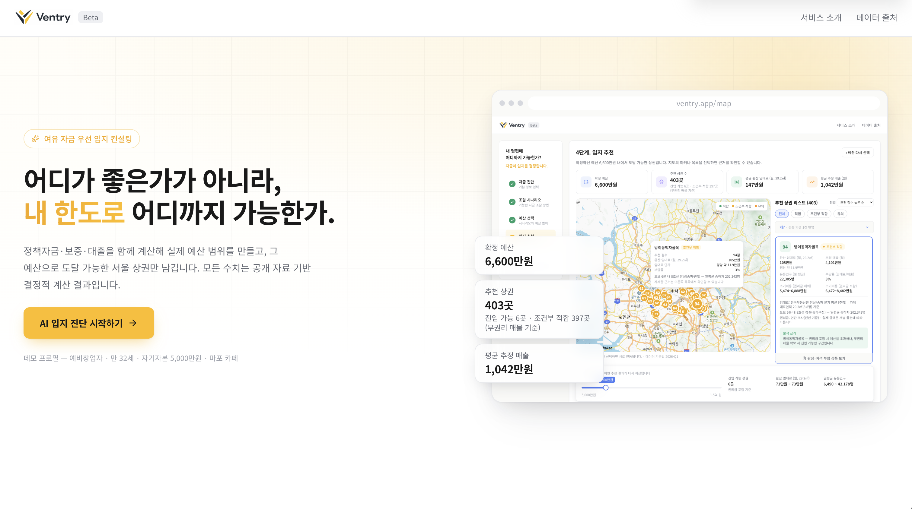
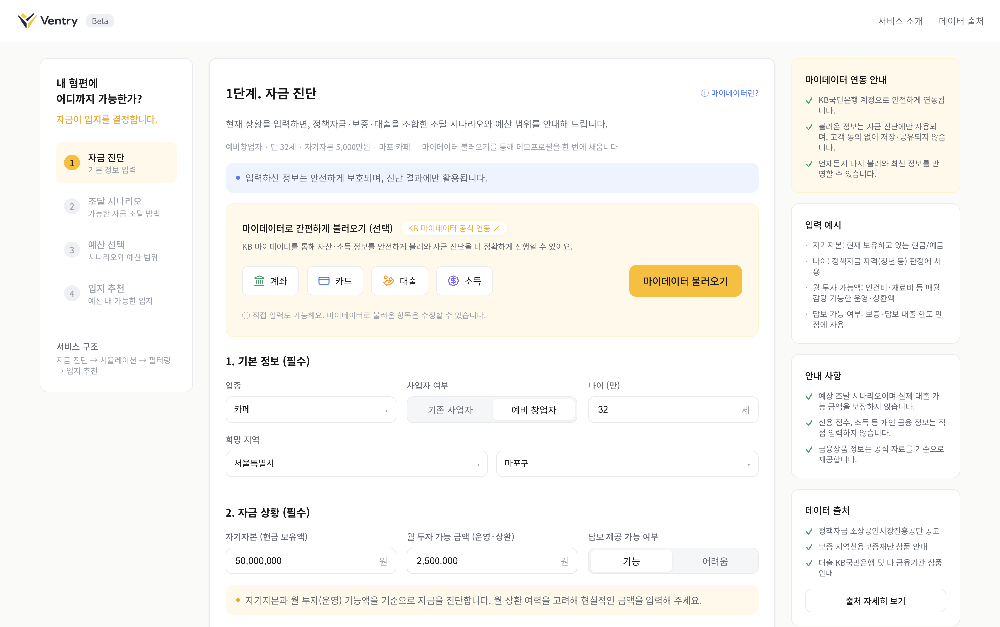
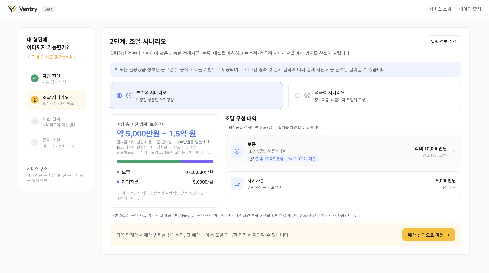
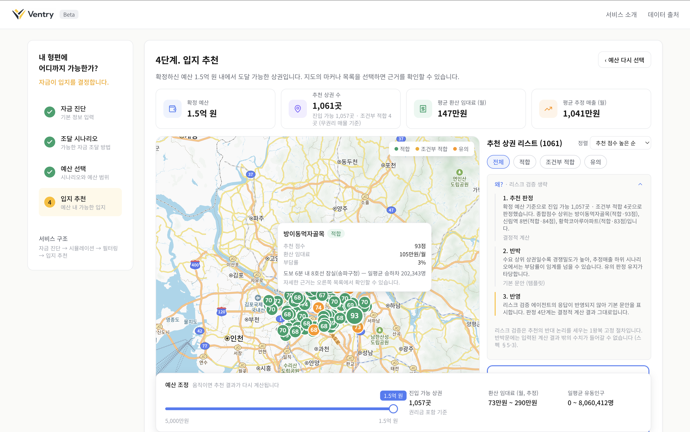

# Ventry — "여금 우선" 입지 컨설팅 에이전트

> KB 제8회 Future Finance AI Challenge · 주제 2 「AI 데이터 기반 최적 입지 컨설팅 서비스」
>
> 기존 상권분석은 **"어디가 좋은가"** 만 답한다. 창업자의 진짜 질문은
> **"내 한도로 어디까지 가능한가"** 다. Ventry는 자금 계획을 먼저 진단하고,
> 진입 가능·지속 가능한 입지를 결정적 계산으로 판정하며, AI가 그 결과를
> 계획·해석·반박한다 — **계산은 도구가, 판단은 에이전트가 한다.**

스코프: 서울 / 카페·음식점 / 판정 4단계 `적합 · 조건부 적합 · 유의 · 범위 외`

---

## 심사 도슨트 가이드 (3분)

```
0. docker compose up --build  →  http://localhost:3000            (약 8초 후 접속 가능)
1. [화면 1] "데모 프로필 불러오기" 클릭 (외식창업자 / 만 32세 / 자기자본 5,000만 / 망원 카페)
   → 폼 + 자유 텍스트 진단 결과 확인 ........................ AI [1] 사용자 이해
                                                              기술설명서 §2
2. [화면 2] 조달 시나리오 2장 → 각 카드의 출처 배지와 공고 원문 인용 주목
   · 보수 6,713만 (범위 5,000~15,000) / 적극 8,398만 (범위 5,000~12,000)
   · 두 라벨은 금액의 대소가 아니라 조달 수단입니다 —
     보수는 보증형만, 적극은 전체 상품을 후보로 봅니다 ....... 기술설명서 §5
3. [화면 3] 예산 8,000만 확정 → 지도·목록에 판정 4단계 마커 + 근거 패널
   · 진입 가능 후보 342곳 (임대료 출처·교통 셀이 상시 표기됩니다)
   · 상위 후보: 방이동먹자골목 🟢 적합(94) · 잠실역 🟢 적합(86) · 을지로입구역 ⚪ 조건부 적합(85)
   · 후보는 **서울 전역**입니다 — 진단의 지역 입력은 지역 한정 상품의 자격 판정에 쓰입니다
4. 탐색 카드 자동 전개 → 헤더의 계획 근거는 LLM의 대화 맥락 판단입니다
   (권리금이 걱정이라고 적었으므로 예산·권리금 두 축이 선택됩니다) .. AI [2] 결정공간 탐색
                                                              기술설명서 §6
   ★ 핵심: T1 인사이트의 진입 수와 지속 수 병기.
     "2,770만 원을 추가 확보하면 진입 가능 후보는 342곳에서 1,018곳으로 늘어납니다.
      다만 상환 부담을 반영하면 지속 안정 후보는 354곳입니다."
     → 차입으로 진입 후보가 3배가 되는데 버틸 수 있는 곳은 그 3분의 1입니다.
       (근거 상품이 변동금리면 월 상환액을 금액으로 표기하지 않고 사유 문구를 함께 보냅니다)
       이 비단조성이 본 서비스의 은행 관점입니다.
5. 판정 옆 "왜? (검증 의견)" 클릭 → 리스크 검증 에이전트의 반박문
   · 입력 사실에 없는 숫자가 섞이면 서버가 응답을 버리고 템플릿으로 돌아갑니다
     (그 사실은 화면에 "검증 생략"으로 표시됩니다) ........... AI [3] 결과 검증
                                                              기술설명서 §7
6. (선택) 슬라이더를 6,000만으로 → 재계산 /
   임의 상권 클릭 → 역방향 판정 + 자격 부합 상품 11건(+공고 원문 인용) .. 기술설명서 §5
```

> **API 키 없이도 전 동선이 동작합니다.** `OPENAI_API_KEY` 를 비운 채 실행하면 LLM 문장 대신
> 템플릿 문장이 최종본이 되고, 검증 패널은 "검증 생략"으로 표시됩니다. 수치·판정은 어느 쪽이든
> 동일합니다 — LLM 은 필수 경로에 없습니다.

**AI 품질 평가 재현**: 아래 3줄로 기술설명서 부록 1·2의 AI 산출물 지표
(추출 정확도 · 근거 충실도 · 민감도 · 설계 교차 검증 모델)가 재산출됩니다.
미실행 시에도 부록 수치로 충분합니다 — 재현 가능성의 존재 자체가 메시지입니다.

```bash
cd ai && python3 -m venv .venv && .venv/bin/pip install -qr requirements.txt
make eval PYTHON=.venv/bin/python     # 산출물: ai/eval/out/{metrics.json, *.png}
```

> 자격 매칭 Precision/Recall은 이 하네스가 채점하지 않습니다. `EligibilityFilter`는 LLM이
> 개입하지 않는 결정적 순수 함수라 백엔드 단위·통합 테스트(`cd backend && ./gradlew test`)가
> 검증합니다 — AI는 AI 산출물만, 결정적 계층은 그 계층의 테스트가. 이 분담 자체가 설계입니다.

**통합 QA 재현**: 기동 중인 스택에 실제 HTTP 를 던져 계약을 검증합니다. 정상 5 + 경계 3 +
장애 2 + SSE 1, 표준 라이브러리만 쓰므로 추가 설치가 필요 없습니다.

```bash
python3 scripts/qa_integration.py                 # 전 시나리오
OPENAI_API_KEY= docker compose up -d --force-recreate api
python3 scripts/qa_integration.py --only F2       # LLM 전면 차단 폴백
```

결과 리포트: [docs/QA_REPORT_BE07.md](docs/QA_REPORT_BE07.md) — 발견해 고친 결함과
**남긴 미해결 항목**을 함께 적었습니다.

브라우저까지 붙여 3파트 통신을 주행 검증한 CM 리포트는
[docs/QA_REPORT_INTEGRATION_CM.md](docs/QA_REPORT_INTEGRATION_CM.md) 입니다 — 화면에 실제로
그려지는 값의 사실성까지 확인하고, 미해결 항목마다 해결 절차를 제안했습니다.

실데이터(`db` 프로파일) 경로에서 계약·불변 원칙이 지켜지는지 경계 조건까지 타격해 본 코드리뷰는
**픽스처 테스트가 통과시키는 결함 27건**(P0 9 · P1 8 · P2 10)과 배치 산출물 정의 결함 9건을
찾았습니다. 조치는 전건 이슈로 분해해 처리했고([#112](https://github.com/yutakdv/Ventry/issues/112)
· [#113](https://github.com/yutakdv/Ventry/issues/113) · [#110](https://github.com/yutakdv/Ventry/issues/110)
· [#111](https://github.com/yutakdv/Ventry/issues/111)), 재발은 **실데이터 계약 게이트 9종(G1~G9)**
이 막습니다 — 매 push 마다 `develop-ci` 의 compose 스모크 단계에서 실행됩니다.

```bash
python3 scripts/qa_integration.py --contract-gate   # G1~G9 (실데이터 계약 게이트)
```

> 리뷰 원본 2건은 내용을 이슈와 [docs/assumptions.md](docs/assumptions.md)(#68~#82)로 옮긴 뒤
> 폐기했습니다 — 같은 사실을 두 곳에 두면 한쪽이 낡습니다.

> 이 가이드는 **비개발자 외부 1인이 3분 안에 위 ★ 지점에 도달하는지**로 검증합니다.
> 실행 대본·기록지·실패 시 조정 순서: [docs/tasks/CM-04_도슨트_테스트_프로토콜.md](docs/tasks/CM-04_도슨트_테스트_프로토콜.md)

---

## 데모 화면

<!-- 캡처 규칙: 1280×800, 라이트 테마, 데모 프로필 상태. FE-06 (D11~12) 태스크에서 교체 -->

| 랜딩 | 화면 1 · 자금 진단 |
|---|---|
|  |  |

| 화면 2 · 조달 시나리오 | 화면 3 · 지도 판정 + 검증 |
|---|---|
|  |  |

> 캡처는 1280×800 · 데모 프로필 기준입니다. 화면이 바뀌면 `docs/QA_REPORT_FE06.md`의 캡처
> 가이드에 따라 `docs/images/demo-{0,1,2,3}.png` 를 다시 찍어 교체하세요.

---

## 아키텍처 (스펙 §1)

```
[배치: Python]                    [저장]              [서빙: Spring Boot]            [프론트]
서울 상권분석 API ────┐
인허가 시가정보 CSV ──┤
부동산원 임대동향 API ┼─ 전처리(pandas/         ┌─ 인터뷰어(파싱: 폼+자연어)      [1]
서울 교통 데이터 ─────┘  geopandas)  →        │  오케스트레이터(tool-calling)
 (역사마스터·승하차)      PostgreSQL ─────────┼→  └ 결정적 도구 계층:            ─SSE→ React
                         (상권DB+정산테이블)  │     자격필터/비용계산/점수·부담률/    +
                                          │     프론티어/역방향                카카오맵
정책자금 문서→LLM 추출   → 구조화+원문 청크 ───┘  결정공간 탐색(이중 프론티어)   [2]
  +사람 검수                                     리스크 검증 에이전트(1왕복)     [3]
                                                  + 원문 근거 인용(청크 직접 조회)
```

- **모든 숫자는 결정적 계산**이 만든다. LLM 역할은 3개뿐: [1] 사용자 이해(파싱·탐색 계획)
  [2] 결정공간 탐색의 해석·언어화 [3] 결과 검증(리스크 반박·원문 인용). 수치 생성 금지.
- **서빙 경로에 ML 없음.** LightGBM+SHAP은 오프라인 배치에서 점수 설계를 교차 검증(스펙 §12)
  — 설명 불가능한 모델을 서빙에 넣지 않기 위한 신뢰 계층 분리.
- 실시간 외부 의존은 카카오맵 JS SDK 단 하나. LLM 장애 시 템플릿 문장이 최종본(데모 무중단).

## 기술 스택

| 영역 | 스택 | 브랜치 |
|---|---|---|
| Frontend | React 18 · Vite · TypeScript · 카카오맵 JS SDK · SSE | `frontend` |
| Backend | Spring Boot 4.1 (Java 25) · PostgreSQL 16 · Caffeine · SseEmitter | `backend` |
| AI/Data | Python 3.11 · pandas · geopandas · LightGBM+SHAP(평가 전용) | `ai` |
| 인프라 | Docker · docker compose · GitHub Actions | — |

## 실행 방법

### 통합 (심사·데모)

```bash
cp .env.example .env       # 카카오맵 앱키 등 입력
docker compose up --build
# web  → http://localhost:3000
# api  → http://localhost:8080/api/health
# db   → localhost:5432 (최초 기동 시 db/init/*.sql 자동 적재)
```

### 영역별 개발

```bash
# Frontend (dev 서버 :5173, /api는 :8080으로 프록시)
cd frontend && npm install && npm run dev

# Backend (JDK 25 필요 — 없으면 docker build ./backend 로 검증)
cd backend && ./gradlew bootRun      # 또는 docker build -t ventry-api . && docker run -p 8080:8080 ventry-api

# AI 배치 (수집→전처리→적재는 로컬 실행, compose 미포함)
cd ai && python -m venv .venv && source .venv/bin/activate
pip install -r requirements.txt
make help
```

각 영역은 **자기 Dockerfile로 단독 검증** 가능: `docker build ./frontend` / `./backend` / `./ai`

## 저장소 구조

```
Ventry/
├── frontend/          # 화면 1(진단) · 2(시나리오) · 3(지도 판정) — FE 담당
├── backend/           # API 6종 + 결정적 도구 계층 + 탐색·검증 에이전트 — BE 담당
├── ai/                # 배치 파이프라인(batch/) + 평가 하네스(eval/, make eval) — AI 담당
├── db/init/           # 배치 산출 사전 적재 덤프 (compose 최초 기동 시 실행)
├── docs/
│   ├── specs/         # 최종 스펙 v6.3 · 탐색 에이전트 스펙 v2.1 (단일 진실 원천)
│   ├── ONBOARDING.md  # 팀원 첫날 30분 가이드
│   ├── TASKS.md       # 태스크 분해 총괄 (D1~D14, 마일스톤·병렬화 구조)
│   ├── tasks/         # 팀원별 상세 체크리스트: FRONTEND.md · BACKEND.md · AI.md
│   ├── API_CONTRACT.md# API 계약 (D3 동결)
│   ├── assumptions.md # 모든 가정·폴백 일원화 대장
│   └── 심사_QA.md      # 예상 Q&A 19문항
├── docker-compose.yaml
├── CONTRIBUTING.md    # 브랜치 전략 · PR/CI 규칙
└── CLAUDE.md          # 팀 공용 AI 어시스턴트 규칙 (co-author 금지 포함)
```

## 브랜치 전략 · CI 요약

```
토픽 브랜치  →(로컬 병합)→  frontend / backend / ai  →(PR: lint·test·docker build + 리뷰 1인)→
                                                       develop  →(compose 스모크)→  main 자동 병합
```

- 토픽 브랜치 이름은 `<태스크ID>-<슬러그>` (예: `be04-frontier`). `backend/…` 형태는 동명
  브랜치가 있어 git이 거부하므로 사용할 수 없다.
- **develop 대상 PR의 head는 항상 영역 브랜치**다 — 토픽에서 직접 올리지 않는다.

상세 규칙·브랜치 보호 설정·커밋 컨벤션은 [CONTRIBUTING.md](CONTRIBUTING.md).

## 데이터 출처 · 라이선스

| 데이터 | 출처 | 주기 |
|---|---|---|
| 추정매출·유동/길단위인구·상주/직장인구·점포·상권변화지표·영역 | 서울 열린데이터광장 상권분석서비스 | 분기 |
| 지하철 역사 좌표 | 서울시 역사마스터 (폴백: t-data 지하철역_GEOM, **CC-BY**) | 분기 |
| 역별 승하차 인원 | 서울시 지하철 승하차 (OA-12914) | 일 |
| 임대료·전환율·상권 구획도 | 한국부동산원 임대동향조사 (API 15099345 + SHP) | 분기 |
| 권리금 | 한국부동산원 임대동향조사 | **연 1회 (전년 기준)** |
| 인허가 시가정보 | 공공데이터포털 (업종 재분류 247 기준 매핑) | 수시 |
| 창업비용 통계 | 소상공인실태조사 (KOSIS) | 연 |
| 정책자금·보증·대출 | 소진공·서울신보·시중은행 공개 문서 (LLM 추출 + 전건 사람 검수) | 수시 |

> **고지**: 본 서비스의 모든 정보는 공개 자료 기반 정보 제공이며 대출 권유·중개·자문이
> 아닙니다. 실제 한도·금리·승인 여부는 해당 기관의 심사에 따릅니다.
